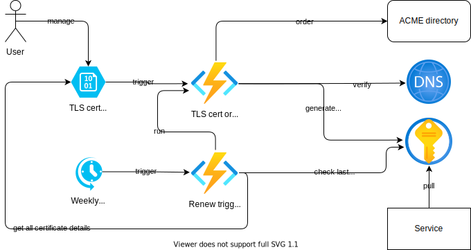

# ACME (Let's Encrypt) certificate to Azure KeyVault

Azure Function application for automating [ACME/Let's Encrypt](https://letsencrypt.org/) TLS certificate generation and renewal.
The certificates are validated using Azure DNS and published to Azure Key Vault.

## How it works



The Azure Function application is composed from multiple functions that coordinate certificate generation and renewal.
Certificate request updates are listened from a blob container in an Azure Storage Account.

When a certificate request (a JSON file) is created or updated, a function is used for the certificate generation:

1. Generate a private key in Key Vault
2. Sign the private key via an ACME directory
3. Respond to the ACME challenge using Azure DNS
4. Store the certificate in Key Vault

Meanwhile, another function is triggered weekly to launch renewal of certificates.
The renewal process is coordinated as follows:

1. Use a function to list all the certificates that need renewal
   1. List all the certificate requests
   2. Compare the certificate requests to the certificates stored in the Key Vault
   3. Select the ones that are about to expire (default: within 30 days)
2. For each certificate that needs to be renewed, launch the certificate generation function mentioned above.

## Certificate settings

New certificates are requests by creating JSON files in a blob container (named `cert-requests` by default).
The files must have suffix `.json` and they can use the following JSON fields:

* `azure` (object): Azure related configurations
  * `subscriptionId` (string): The Azure subcription ID where the DNS zone can be found from
  * `dnsZoneResourceGroup` (string): The resource group where the DNS zone is located
  * `dnsZone` (string): The name of the Azure DNS zone to use for certificate validation
  * `keyVaultName` (string): The name of the Key Vault where to store the TLS certificates
  * `keyVaultCertName` (string): The name of the TLS certificate in the Key Vault
* `acme` (object): ACME/Let's Encrypt related configurations
  * `acmeDirectoryUrl` (string): The URL of the ACME directory that signs the TLS certificate. With Let's Encrypt, typically either of these would be used:
    * Staging: `https://acme-staging-v02.api.letsencrypt.org/directory`
    * Production: `https://acme-v02.api.letsencrypt.org/directory`
  * `contactEmail` (string): The contact email address to use when registering a certificate
* `certKey` (object): TLS certificate key related configurations
  * `commonName` (string): The common name (domain) for the certificate key
  * `subject` (string, optional): Other subject fields for the certificate. Common name is automatically filled in.
  * `alternativeNames`: (array of strings, optional): Other domain names to include in the certificate key
  * `keySize`: (number, optional): The size of the private key in bits (default: 2048)
  * `exportable`: (boolean, optional): Is the certificate and its key exportable from Key Vault (default: false)

Example:

```json
{
  "azure": {
    "subscriptionId": "aabbccddee-1111-2222-3333-0000000000",
    "dnsZoneResourceGroup": "my-dns-rg",
    "dnsZone": "example.org",
    "keyVaultName": "acme-kv",
    "keyVaultCertName": "exampleorg"
  },
  "acme": {
    "acmeDirectoryUrl": "https://acme-staging-v02.api.letsencrypt.org/directory",
    "contactEmail": "myemail@example.org"
  },
  "certKey": {
    "commonName": "example.org",
    "alternativeNames": [
      "www.example.org"
    ]
  }
}
```

## Function app settings

The function can be configured with the following environment variables:

* `CERT_REQ_CONTAINER`:
  Name of the blob container where all the certificate requests are stored.
  If you change this from the default `cert-requests`, make sure you update the `function.json` files to match it.
* `RENEW_DAYS_THRESHOLD`:
  When a certificate has this many (or less) days left until it expires, it will be renewed.
  Default: `30`

## Setup instructions

To set up the application, follow these steps.

### DNS zone in Azure DNS

The code assumes that your domain records are hosted on [Azure DNS](https://azure.microsoft.com/en-us/services/dns/).
The TLS certificate verification is done by creating a TXT record on the chosen DNS zone.

To set up a DNS zone in Azure, [follow the official guide](https://docs.microsoft.com/en-us/azure/dns/dns-getstarted-portal).
Once you've created the zone, write down the name of the resource group where the zone is located and the zone name.

### Resource group for the app

Next, we'll create a resource group for all of the function app resources:

```
az group create --name acme2keyvault-rg --location westeurope
```

### Key Vault

The app uses [Azure Key Vault](https://azure.microsoft.com/en-us/services/key-vault/) to store the TLS certificates and the generate their private keys.
Let's create it:

```
az keyvault create \
  --location westeurope \
  --name <vault name>
  --resource-group acme2keyvault-rg \
  --enable-rbac-authorization
```

The vault name must be globally unique in Key Vault.
The RBAC authorization is required to grant the function app access to the vault.

### Storage account for functions data

The functions app requires a storage account to store the information on the certificates we want to provision and store the internal data of the functions.
Let's create it:

```
az storage account create \
  --name <storage account name> \
  --location westeurope \
  --resource-group acme2keyvault-rg \
  --sku Standard_LRS
```

Similar to the vault name, the storage account name must be globally unique in Azure Storage.

We also need a blob container in the storage account to store details on the certificates we want to generate.

```
az storage container create \
  --auth-mode login \
  --account-name <storage account name> \
  --name cert-requests
```

### Function application

Next, we can create the environment for the function application:

```
az functionapp create \
  --resource-group acme2keyvault-rg \
  --consumption-plan-location westeurope \
  --runtime node --runtime-version 14 --functions-version 3 \
  --name acme2keyvault \
  --storage-account <storage account name> \
  --assign-identity '[system]'
```

The storage account name from the earlier step should be used here as well.
The system identity (aka managed identity) is later used for assigning permissions to use Key Vault and DNS zones.

After the function application has been created, we can [customize the app settings](https://docs.microsoft.com/en-us/azure/azure-functions/functions-how-to-use-azure-function-app-settings).
See the function app settings section above for a full list of what you can configure.

### RBAC roles

Since the code will modify the Azure DNS and Key Vault, access must be granted to it using RBAC (role-based access control).
The roles that grant these permissions are stored in the `az-roles` directory of this repository as JSON files.
To use them, you must first edit the files and replace the `<subcription ID>` part with your Azure subscription ID.
After that, let's create the roles:

```
az role definition create --role-definition az-roles/dns-txt-editor.json

az role definition create --role-definition az-roles/keyvault-cert-editor.json
```

The roles need to assign them to the function app's system identity.
First, we need to find the principal ID of the system identity:

```
az functionapp show \
  --name acme2keyvault \
  --resource-group acme2keyvault-rg \
  --query 'identity.principalId' \
  --output tsv
```

Let's create role assignments for the above principal ID:

```
az role assignment create \
  --role "Key Vault Certificate Editor" \
  --assignee <principal ID> \
  --scope '/subscriptions/<subscription ID>/resourceGroups/acme2keyvaul
t-rg/providers/Microsoft.KeyVault/vaults/<vault name>'

az role assignment create \
  --role "DNS TXT record editor" \
  --assignee <principal ID> \
  --scope '/subscriptions/<subscription ID>/resourceGroups/<DNS resource group>/providers/Microsoft.Network/dnszones/<DNS zone name>'
```

Make sure to replace the subcription ID, vault name, DNS resource group, and DNS zone name with the appropriate values.
You can also use a subscription or resource group scopes to grant the function wider access.

Access to the storage account is granted through the storage account shared keys as required by Azure Function.

### Build and deploy

The code can be built using the following NPM command:

```
npm run build
```

You can deploy the function with the [Azure Functions Core Tools](https://docs.microsoft.com/en-us/azure/azure-functions/functions-run-local#v2):

```
func azure functionapp publish acme2keyvault
```

Now you can upload your certificate requests to the `cert-requests` blob container you created earlier.
See the certificate settings section above for more details.

## License

MIT License

See [LICENSE](LICENSE) for more details.
